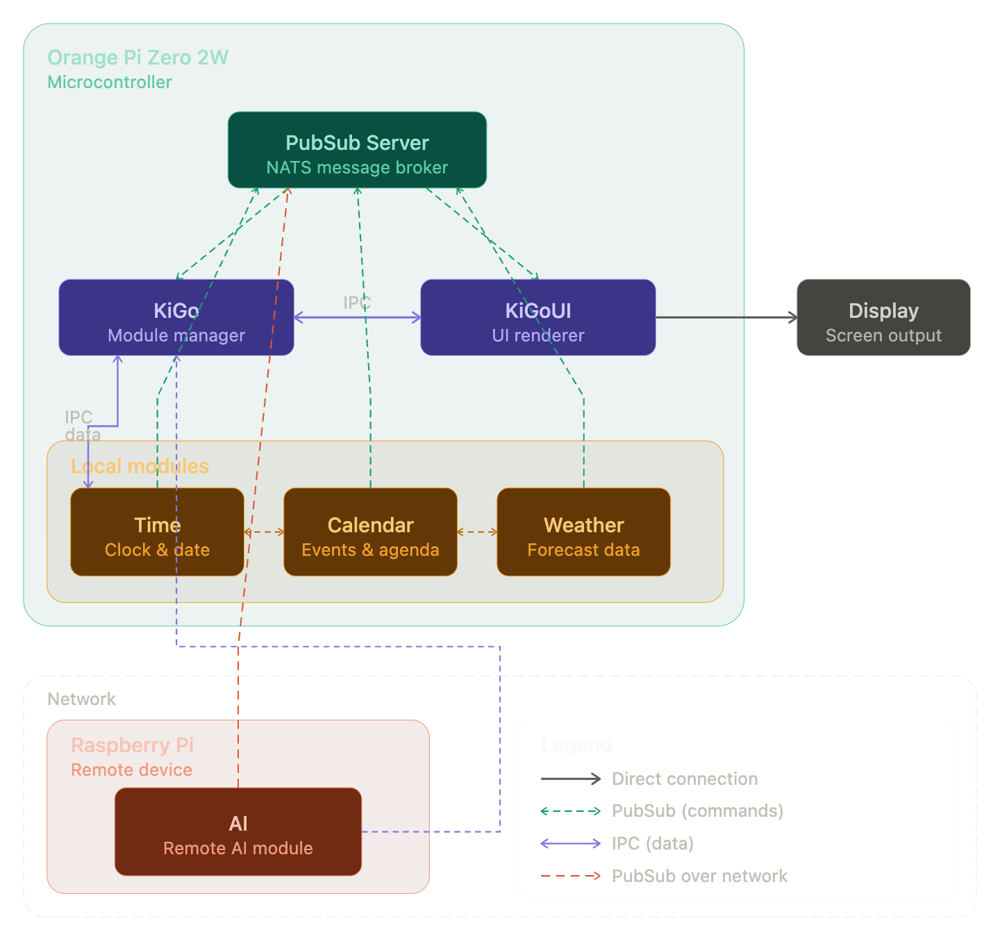

# Kigo

A smart mirror implemented in Go, where modules communicate using pubsub architecture. 
There are 2 fix processes, `KiGoUI` and `KiGo`. The `KiGoUI` is responsible for handling the screen(s) and drawing. KiGo is responsible to have the logic responsible to handle/manage modules and failures. Modules are third party processes with logic about what to be shown on the screens. A packagemanager `KiGoMa` is responsible for downloading third party modules from any repository (Schema needs to be implemented)
Modules can be run everywhere you want, `KiGoUI` and `KiGo` (for now) are running on the device connected to the screen. The modules can be run on the same device or at a remote devices. This gives us the benefit of expanding heavy loads, i.e. ML/AI/SMLs (your choice). For a distributed architecture some changes would need to me made. `KiGo` will have a REST API which is currently (only ping and metrics) unfineshed and should integrate `KiGoMa`.
The scope of `KigoMa` would be to download and start modules.

I will use [GoGPU](https://github.com/gogpu/ui) as soon at is available for the `KiGoUI`. [Nats](https://nats.io/) for pubsub and my on lib sca-instruments for util and intrumentation, future REST API for external actors. Shared memory for drawing/sharing 

[KiGoCore](https://github.com/AgentNemo00/kigo-core) has the current definition of the inter process messages.

A list of modules implemented from [this list](https://github.com/MagicMirrorOrg/MagicMirror/wiki/3rd-Party-Modules):

| Module | Implemented |
| --- | --- |
| Text |  |
| Time |  |
| Calendar |  |
| Mail |  |
| Weather |  |
| Notifications |  |

